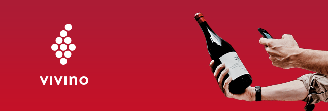
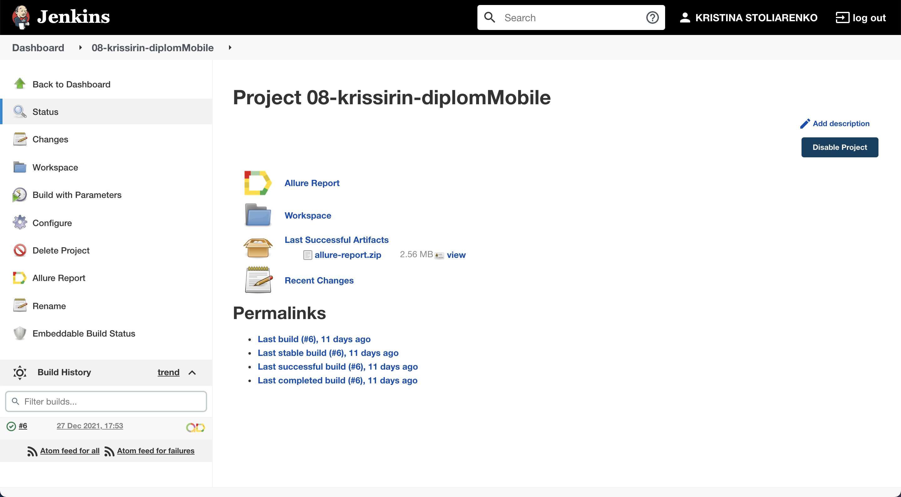
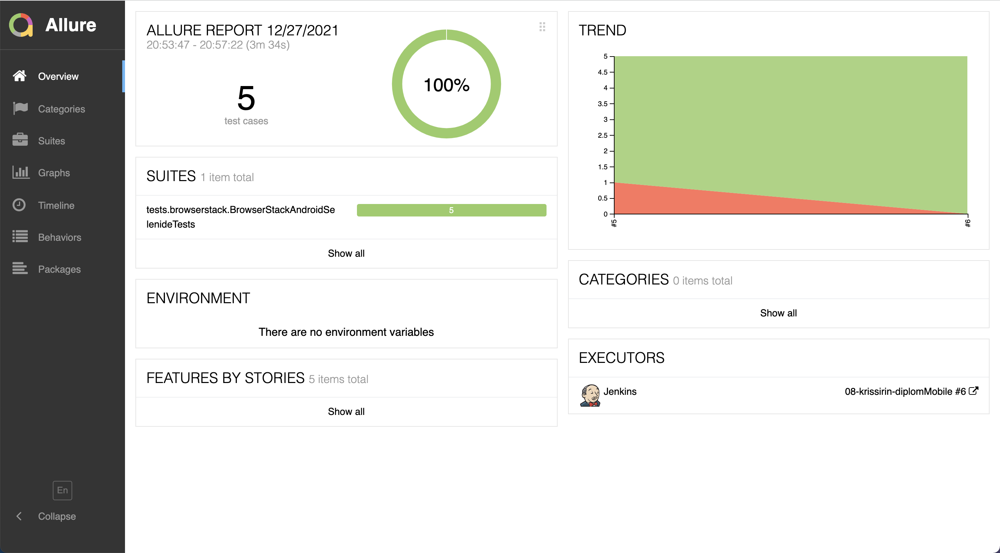
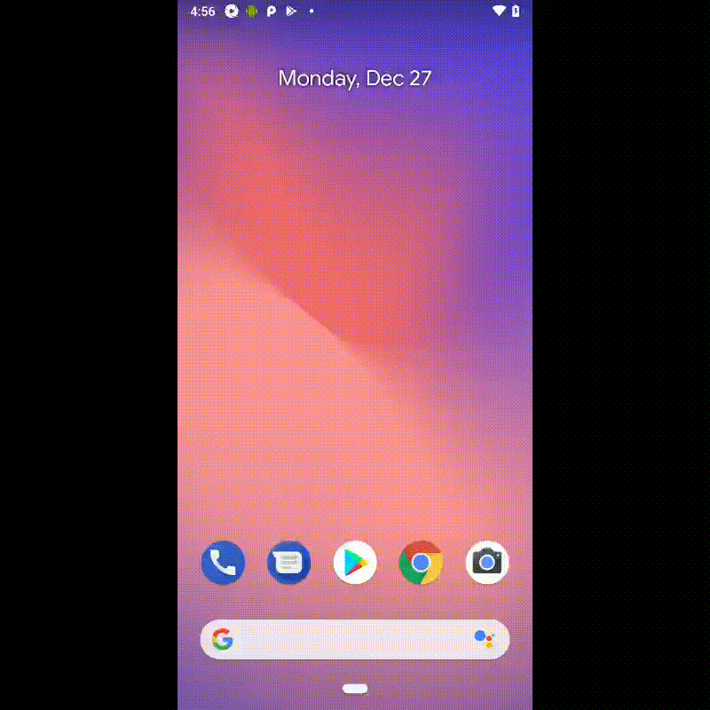

# :wine_glass: Автотесты для мобильного приложения Vivino



## :stethoscope: Стек:
| GitHub | IDEA | Java | Junit5 | Gradle | Selenide | Selenoid | Browserstack | Allure Report | Allure TO | Jenkins | Jira |
|:--------:|:-------------:|:---------:|:-------:|:----:|:------:|:----:|:----:|:----:|:------:|:------:|:--------:|
|  |  |  |  |  |  |  |  |  |  |  |  |

## Для запуска тестов используются команды:
```bash
gradle clean test -DdeviceFarm="${DEVICE_FARM}"
```
В качестве параметра `${DEVICE_FARM}` может быть передано:
- browserstack - для запуска в **[Browserstack](https://www.browserstack.com/)**
- selenoid - для запуска в **[Selenoid](https://selenoid.autotests.cloud/wd/hub/)**
- local - для запуска локально через **[Appium](https://appium.io/)**

## Запуск тестов происходит в CI [Jenkins](https://jenkins.autotests.cloud/job/08-krissirin-diplomMobile/)


## Генерация отчетов происходит в [Allure](https://jenkins.autotests.cloud/job/08-krissirin-diplomMobile/allure/)


## Пример видео из отчета
